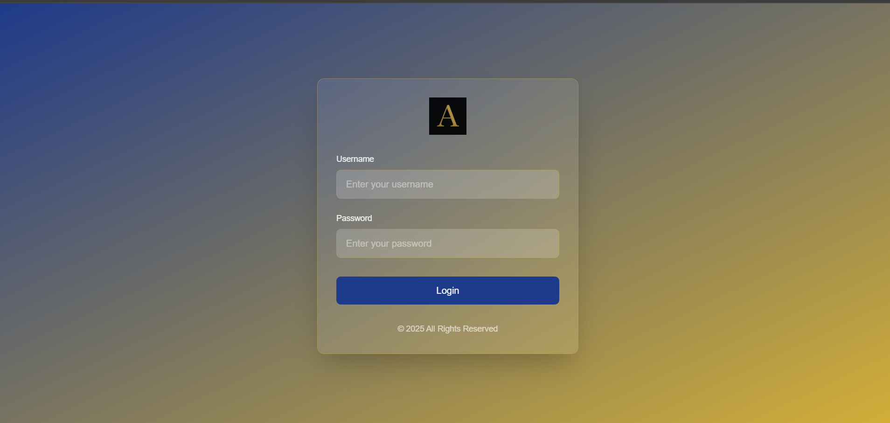
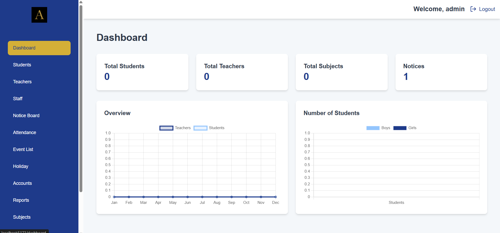

# 🎓 School Management Software (SaaS)

A modern, full-featured **School Management System** built with **React (Vite)**, **Node.js (Express)**, **Tailwind CSS**, and **Microsoft SQL Server**.

This platform simplifies student, staff, and visitor management through **role-based access**, real-time **analytics**, and a clean, intuitive UI.

> ✨ Perfect for educational institutions looking for a lightweight, scalable, and secure digital solution.

---

## 🔧 Tech Stack

| Layer       | Technologies Used                               |
|-------------|--------------------------------------------------|
| Frontend    | React.js, Vite, Tailwind CSS                    |
| Backend     | Node.js, Express.js                             |
| Database    | Microsoft SQL Server                            |
| Auth        | JWT (JSON Web Token)                            |
| UI/UX       | Responsive, Accessible, Role-Based              |

---

## 🚀 Core Features

- 👩‍🏫 Role-Based Access (Admin, Staff, Teachers)
- 📋 Student, Teachers and Staff Management
- 🛡️ Secure JWT Authentication
- 📊 Dashboard with Real-Time Analytics
- ⚙️ Admin Settings Panel

---

## 🖼️ UI Preview

### 🔐 Login Page

### 📊 Admin Dashboard

---

## 📁 Project Structure

school-management-software/
├── client/ # React frontend (Vite)
├── server/ # Node.js backend (Express)
│ └── database/
│ └── school_management.bacpac
├── assets/ # Project screenshots for README
└── README.md

---

## ⚙️ Local Setup Guide

### 1️⃣ Clone the Repository

git clone https://github.com/Arya4546/school-management-software
cd school-management-software
2️⃣ Install Dependencies
Frontend:

cd client
npm install
Backend:

cd ../server
npm install
3️⃣ Setup Environment Variables
🗂️ client/.env

VITE_API_URL=http://localhost:5000
🗂️ server/.env

PORT=5000
DB_SERVER=Server Name
DB_NAME=school_management
DB_USER=Your DB user
DB_PASSWORD= Your Password
DB_PORT=your DB Port
JWT_SECRET=YourSuperSecretKey

4️⃣ Import SQL Server Database
The project includes a pre-configured .bacpac file with all tables and sample data.

🧩 To Import:
Open SQL Server Management Studio (SSMS).

Right-click on Databases → Import Data-tier Application.

Select the .bacpac file:
server/database/school_management.bacpac

Complete the wizard. Your database will be created as school_management.

5️⃣ Run the App
▶️ Start Backend (Server)

cd server
npm run dev
▶️ Start Frontend (Client)

cd ../client
npm run dev
🔗 Access the app at: http://localhost:5173

📌 Important Notes
Ensure SQL Server is running on your system .

Port must be open and accessible.

Keep your .env files secure and never push them to public repos.

👨‍💻 Developed By
Arya Deep Singh
🔗 GitHub: https://github.com/Arya4546 • LinkedIn: https://www.linkedin.com/in/arya-deep-singh-8b1a84230

Passionate Full Stack Developer with a focus on real-world SaaS solutions.
